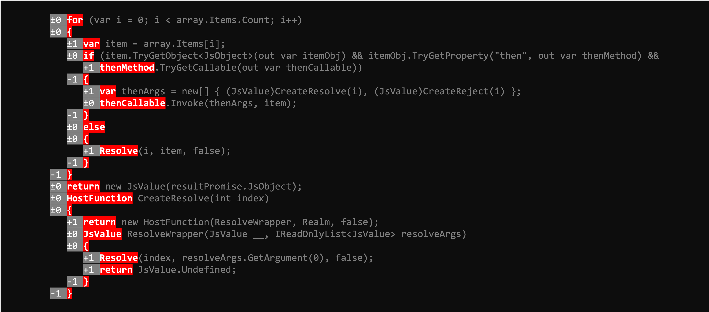

# QuickDup - Delta-Indent Clone Detection

## The shape of code

QuickDup is a fast structural code clone detector that:
* Identifies duplicate code patterns using indent-delta fingerprinting.
* Is designed as a candidate generator for AI-assisted code review.

## Performance

- **~100k lines of code in ~500 ms** on 8 cores
- Parallel file parsing and pattern detection
- Lightweight fingerprinting (no AST parsing)

## Philosophy

Traditional clone detection optimizes for **precision** — minimizing false positives. QuickDup optimizes for **speed and recall** — surface candidates fast, let AI verify.

```
┌─────────────────┐     ┌─────────────────┐     ┌─────────────────┐
│    QuickDup     │ ──▶ │    AI Agent     │ ──▶ │  Human Decision │
│  (candidates)   │     │  (verification) │     │                 │
└─────────────────┘     └─────────────────┘     └─────────────────┘
```

## Algorithm

### Phase 1: Parse Files (Parallel)

Extract structural fingerprint per line:

| Field         | Description                              |
| ------------- | ---------------------------------------- |
| `IndentDelta` | Change in indentation from previous line |
| `Word`        | First token on the line                  |
| `SourceLine`  | Original source for output               |

Comments and blank lines are skipped. Comment prefixes are auto-detected by file extension.

Example:


This pattern, generates a fingerprint sequence based on the indentation deltas and first words that is deterministic, every occurance of this pattern will yield the same fingerprint sequence.

The fingerprint may seem too naive, but in practice it captures the **structural shape** of code well enough to find "candidate" duplicates quickly, the token similarity phase later filters out most of the false positives.

The actual identification of duplicates happens after phase 3, you feed this information to an AI model to verify if the candidates are true duplicates or not, and either automatically refactor them or present them to a human for review.

### Phase 2: Grow-Based Pattern Detection (Parallel)

1. Generate base patterns of minimum size (default: 3 lines)
2. Keep patterns with 3+ occurrences
3. Grow patterns by 1 line, repeat until no patterns survive
4. Track which occurrences grew vs. stopped (only report maximal patterns)

This finds the **longest** duplicate patterns, not just fixed windows.

### Phase 3: Token Similarity & Scoring

Patterns with similar structure but different actual code are filtered:

1. Tokenize source lines of each occurrence
2. Compute Jaccard similarity (intersection/union of token sets)
3. Filter patterns below threshold (default: 50%)
4. Score patterns: `uniqueWords + (similarity × 5)`

This eliminates most false positives like "all error handlers look similar structurally but have different messages." High similarity (especially 100% verbatim matches) boosts the score, surfacing the most actionable duplications first.

### Phase 4: Output

Results written to `.quickdup/` directory:
- `results.json` — Machine-readable patterns with locations

## Installation

**Linux/macOS:**
```bash
curl -sSL https://raw.githubusercontent.com/asynkron/Asynkron.QuickDup/main/install.sh | bash
```

**Windows (PowerShell):**
```powershell
iwr -useb https://raw.githubusercontent.com/asynkron/Asynkron.QuickDup/main/install.ps1 | iex
```

**From source:**
```bash
go install github.com/asynkron/Asynkron.QuickDup/cmd/quickdup@latest
```

## Usage

```bash
# Scan Go files in current directory
quickdup -path . -ext .go

# Scan C# files with stricter similarity threshold
quickdup -path ./src -ext .cs -min-similarity 0.7

# Show top 20 patterns, require 5+ occurrences
quickdup -path . -ext .ts -top 20 -min 5

# Scan a single file (or pass a file path to -path)
quickdup --file ./src/main.go

# Verbose progress for long-running phases
quickdup --file ./src/main.go --debug

# Hard timeout (seconds)
quickdup --file ./src/main.go --timeout 20

# Cap pattern growth at 50 lines
quickdup -path . -ext .go --max-size 50
```

## Flags

| Flag                  | Default | Description                                              |
| --------------------- | ------- | -------------------------------------------------------- |
| `-path`               | `.`     | Directory to scan recursively                            |
| `-file`               |         | Scan a single file (overrides `-path`)                   |
| `-ext`                | `.go`   | File extension to match                                  |
| `-min`                | `3`     | Minimum occurrences to report                            |
| `-min-size`           | `3`     | Base pattern size (lines) to start growing from          |
| `-max-size`           | `0`     | Maximum pattern size to grow to (0 = no limit)           |
| `-min-score`          | `5`     | Minimum score (unique words + similarity bonus)          |
| `-min-similarity`     | `0.5`   | Minimum token similarity between occurrences (0.0-1.0)   |
| `-top`                | `10`    | Show top N patterns by score                             |
| `-comment`            | auto    | Override comment prefix (auto-detected by extension)     |
| `-no-cache`           | `false` | Disable incremental caching, force full re-parse         |
| `-github-annotations` | `false` | Output GitHub Actions annotations for inline PR comments |
| `-debug`              | `false` | Print verbose progress for long-running phases           |
| `-timeout`            | `20`    | Hard timeout in seconds (0 disables)                     |

## GitHub Actions Integration

QuickDup can output annotations that GitHub displays as inline comments on pull requests:

```yaml
- name: Run QuickDup
  run: quickdup -path . -ext .go --github-annotations --no-cache
```

When `--github-annotations` is enabled, QuickDup outputs warnings in GitHub's annotation format and skips writing `.quickdup/results.json` and `patterns.md`.

## Incremental Caching

QuickDup caches parsed file data in `.quickdup/cache.gob`. On subsequent runs, only modified files are re-parsed:

```
Parsed 558 files (542 cached, 16 parsed) (98234 lines of code)
```

This dramatically speeds up repeated runs during development. Use `-no-cache` to force a full re-parse.

## Ignoring Patterns

Create `.quickdup/ignore.json` to suppress known patterns:

```json
{
  "description": "Patterns to ignore",
  "ignored": [
    "56c2f5f9b27ed5a0",
    "c32ca0ee344f8e23"
  ]
}
```

Pattern hashes are shown in the output for easy copy-paste.

## Supported Languages

Comment prefixes are auto-detected for:

- **C-style** (`//`): Go, C, C++, Java, JavaScript, TypeScript, C#, Swift, Kotlin, Rust, PHP, Dart, Zig
- **Hash** (`#`): Python, Ruby, Shell, Perl, R, YAML, TOML, PowerShell, Nim, Julia, Elixir
- **Double-dash** (`--`): SQL, Lua, Haskell, Elm, Ada, VHDL
- **Semicolon** (`;`): Lisp, Clojure, Scheme, Assembly
- **Percent** (`%`): LaTeX, MATLAB, Erlang, Prolog

Use `-comment` to override for unsupported extensions.

## Example Output

```
Scanning 558 files using 8 workers...
Parsed 558 files (98234 lines of code)
Detecting patterns...
Growth stopped at 148 lines
Filtered 23 low-similarity patterns (similarity < 50%)
Found 2410 patterns with 3+ occurrences (showing top 10 by score)

Score 15 [79 lines, 15 unique] found 3 times [a1b2c3d4e5f67890]:
  src/services/auth.go:142
  src/services/oauth.go:89
  src/services/saml.go:201

...

Total: 2410 duplicate patterns in 558 files (98234 lines) in ~500ms
```

## Limitations

This is a **heuristic candidate generator**:

- **False positives** — Structural similarity doesn't guarantee semantic duplication
- **False negatives** — Different structure with same semantics won't match

Token similarity filtering and clustering catch cases where occurrences differ significantly. Small differences (a few tokens in a large pattern) won't affect similarity much — which is intentional, as those are likely real duplicates with minor variations.

## License

MIT

## Adding screenshots with termshot (2026-01-07T11:34:39.148Z)

Prerequisites
- termshot installed and available in PATH
- This repository cloned locally

Steps
```bash
set -euo pipefail
ROOT="$HOME/git/asynkron/QuickDup"
IMGDIR="$ROOT/assets/images"
mkdir -p "$IMGDIR"
cd "$ROOT"

# Take a screenshot of a command invocation
termshot -- <your command here>

# Save the resulting image with a descriptive name
cp -f out.png "$IMGDIR/<your-image-name>.png"

# Append to the README (example snippet)
cat >> README.md <<EOT

## Screenshots ($(date -u +%Y-%m-%dT%H:%M:%S.%3NZ))

Command: <your command here>


EOT

# Commit and push
git add README.md assets/images/*
git commit -m "Add screenshot <your-image-name>.png"
git push
```

Notes
- Repeat the termshot/copy/append steps for additional variations (e.g., different flags).
- Keep images under assets/images and reference them with relative paths in README.
